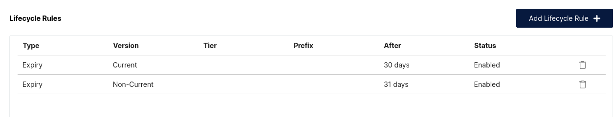

# MinIO 命令操作手册

MinIO 是一个高性能的对象存储系统，兼容 Amazon S3 API。本文档介绍常用的 mc (MinIO Client) 命令操作。

## 客户端配置

### 查看已配置的别名

```bash
mc alias list
```

### 添加 MinIO 服务器别名

```bash
mc alias set <别名> <服务器地址> <用户名> <密码>
```

示例：

```bash
mc alias set your-minio http://your.minio.xxxx.com:9000 username password
```

## 存储空间管理

### 查看存储占用

```bash
# 总存储空间占用
mc du your-minio

# 每个桶下面的存储空间占用
mc du your-minio --depth 1
```

### 数据存储组织格式

查看桶内数据组织结构：

```bash
mc ls your-minio/backup-bucket/
```

输出示例：

```
[2026-04-13 09:57:12 CST]     0B 202502010210/
[2026-04-13 09:57:12 CST]     0B 202502020210/
[2026-04-13 09:57:12 CST]     0B 202502030210/
[2026-04-13 09:57:12 CST]     0B 202502040210/
[2026-04-13 09:57:12 CST]     0B 202502050210/
[2026-04-13 09:57:12 CST]     0B 202502060210/
[2026-04-13 09:57:12 CST]     0B 202502070210/
[2026-04-13 09:57:12 CST]     0B 202502080210/
[2026-04-13 09:57:12 CST]     0B 202502090210/
[2026-04-13 09:57:12 CST]     0B 202502100210/
[2026-04-13 09:57:12 CST]     0B 202502110210/
```

## 数据删除操作

### 按前缀删除

删除以 2024 开头的所有数据：

```bash
mc rm --recursive --force your-minio/bucketname/2024
```

示例：

```bash
mc rm --recursive --force your-minio/backup-bucket/2024
```

### 按日期条件批量删除

删除指定日期之前的数据（注意事项：日期目录后面保留 `/` 反斜杠）：

```bash
# 先预览要删除的对象
mc ls your-minio/backup-bucket/ | awk '$5 < "202504010210/" {print $5}'

# 确认后执行删除
mc ls your-minio/backup-bucket/ | \
  awk '$5 < "202504010210/" {print $5}' | \
  xargs -I {} mc rm --recursive --force your-minio/backup-bucket/{}
```

更多示例：

```bash
# 预览 202601010000 之前的数据
mc ls your-minio/backup-bucket/ | awk '$5 < "202601010000/" {print $5}'

# 删除 202601010000 之前的数据
mc ls your-minio/backup-bucket/ | \
  awk '$5 < "202601010000/" {print $5}' | \
  xargs -I {} mc rm --recursive --force your-minio/backup-bucket/{}

# 删除特定年份数据
mc rm --recursive --force your-minio/backup-bucket/2024

# 删除特定日期数据
mc rm --recursive --force your-minio/backup-bucket/20260316
```

## 版本控制管理

### 查看版本控制状态

```bash
mc version info your-minio/backup-bucket/
```

### 标记删除

普通删除在开启版本控制的桶中只会创建删除标记，不会真正删除数据：

输出示例：

```
Created delete marker `your-minio/backup-bucket/202603180100/db@table.json` (versionId=961ddc99-3109-43f9-a56e-09e5d6ceb585).
Created delete marker `your-minio/backup-bucket/202603180100/db@table.sql` (versionId=2861df3c-1566-41bf-9ae6-58028162b0e4).
Created delete marker `your-minio/backup-bucket/202603180100/db@table@@0.tsv.zst` (versionId=ab7d2b98-8292-4b33-8922-25329f91abc9).
Created delete marker `your-minio/backup-bucket/202603180100/db@table@@0.tsv.zst.idx` (versionId=51c737e7-094d-459f-88be-eead9c3ebbf4).
```

### 查看带版本信息的对象

```bash
mc ls --versions your-minio/backup-bucket/202603170100
```

### 彻底删除所有版本

删除所有版本，真正释放存储空间：

```bash
mc rm --recursive --force --versions your-minio/backup-bucket/20260316
```

输出示例：

```
Removed `your-minio/backup-bucket/202603160100/db@table@001.tsv.zst.idx` (versionId=acb74a9e-ce50-49a2-8019-3dc3980bf84b).
Removed `your-minio/backup-bucket/202603160100/db@table@001.tsv.zst.idx` (versionId=479173d8-94ea-41e7-8836-a0c250a4672f).
Removed `your-minio/backup-bucket/202603160100/db@table@002.tsv.zst` (versionId=1fb82a66-8310-45b9-a1fb-1b78573f64b8).
Removed `your-minio/backup-bucket/202603160100/db@table@002.tsv.zst` (versionId=38b5ef9a-7d2f-4b19-80bc-70156f8023b6).
Removed `your-minio/backup-bucket/202603160100/db@table@002.tsv.zst.idx` (versionId=97cb46c9-f635-4219-97c2-c8bc6694d5a7).
Removed `your-minio/backup-bucket/202603160100/db@table@002.tsv.zst.idx` (versionId=65211bf5-9c6b-43be-bddb-96318c065051).
Removed `your-minio/backup-bucket/202603160100/db@table@003.tsv.zst` (versionId=a5c823b6-d022-4f97-af99-369be5275543).
```

## 扫描管理

### 查看扫描器状态

```bash
mc admin scanner status your-minio
```

输出示例：

```
Overall Statistics
------------------
Last full scan time:   0d4h4m; Estimated 176.89/month
Current cycle:         53396; Started: 2026-04-13 04:59:27.090110844 +0000 UTC
Active drives: 2

Last Minute Statistics
----------------------
Objects Scanned:       26911 objects; Avg: 524.031µs; Rate: 38751840/day
Versions Scanned:      50743 versions; Avg: 131.865µs; Rate: 73069920/day
Versions Heal Checked: 116 versions; Avg: 51.725ms; Rate: 167040/day
Read Metadata:         26911 objects; Avg: 192.516µs, Size: 485 bytes/obj
ILM checks:            50743 versions; Avg: 5.111µs
Check Replication:     50742 versions; Avg: 1.435µs
Verify Deleted:        0 folders; Avg: 0ms
ILM, DeleteAction:     225 actions; Avg: 4.006µs.
Yield:                 1m22.6s total; Avg: 3.071ms/obj

------------------------------------- Currently Scanning Paths --------------------------------------
minio-node-1.minio-headless.backup.svc.cluster.local:9000/data-1/backup-bucket/202505030200/db@table...
minio-node-2.minio-headless.backup.svc.cluster.local:9000/data-1/backup-bucket/202511260100/db@cache...
```

### 调整扫描参数

```bash
# 1. 降低扫描速度，减少对业务的影响
mc admin config set your-minio scanner speed=slow

# 2. 调整扫描周期，避开业务高峰
mc admin config set your-minio scanner cycle=24h
```

## 注意事项

### 版本控制与生命周期规则

1. **界面设置 Lifecycle Rules 的坑**：对于开启 version 的桶，在界面中设置 Lifecycle Rules，实际上数据并没有删除，会造成磁盘空间被占满风险。

2. **正确配置**：需要同时配置 Lifecycle Rules Non-Current 的生命管理策略。

   

3. **Lifecycle Rules 副作用**：会清空数据但是却保留一个空文件夹。

### 删除操作注意事项

- 批量删除时使用 `awk` 过滤，注意目录名后的 `/` 反斜杠不能省略
- 生产环境执行删除前，务必先用 `mc ls` 预览确认
- 开启版本控制的桶，普通删除只会创建删除标记，需使用 `--versions` 参数才能彻底释放空间

## 常用命令速查

| 命令 | 说明 |
|------|------|
| `mc alias list` | 查看已配置的别名 |
| `mc alias set <别名> <地址> <用户> <密码>` | 添加服务器别名 |
| `mc du <别名>` | 查看存储使用情况 |
| `mc ls <别名>/<桶名>` | 列出对象 |
| `mc ls --versions <路径>` | 列出带版本信息的对象 |
| `mc rm --recursive --force <路径>` | 递归删除（创建删除标记） |
| `mc rm --recursive --force --versions <路径>` | 彻底删除所有版本 |
| `mc version info <路径>` | 查看版本控制状态 |
| `mc admin scanner status <别名>` | 查看扫描器状态 |
| `mc admin config set <别名> scanner speed=slow` | 降低扫描速度 |
| `mc admin config set <别名> scanner cycle=24h` | 调整扫描周期 |
