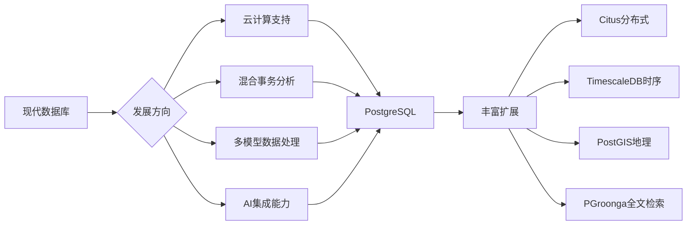

# 🐘 PostgreSQL 专业文档中心

  <h2>开源关系型数据库管理系统的世界标准</h2>
  
<strong>高性能 • 高可靠 • 高扩展 </strong>

---

## 📚 快速导航

  

    <h3>🚀 安装与配置</h3>
    
详细了解 PostgreSQL 的安装部署和性能配置方法。

    <a href="./install/" class="btn">详情</a>
  

  
  

    <h3>🔐 安全管理</h3>
    
掌握 PostgreSQL 中的用户权限和安全认证策略。

    <a href="./security/" class="btn">详情</a>
  

  
  

    <h3>🏗️ 索引与查询优化</h3>
    
优化数据库索引设计和查询性能提升技术。

    <a href="./index/" class="btn">详情</a>
  

  
  

    <h3>⚡ 性能优化</h3>
    
全面的数据库性能分析与调优方法论。

    <a href="./performance/" class="btn">详情</a>
  

  
  

    <h3>🔄 数据同步</h3>
    
深入理解流复制、逻辑复制等数据同步机制。

    <a href="./replication/" class="btn">详情</a>
  

  
  

    <h3>💾 备份与恢复</h3>
    
保障数据安全的备份策略与恢复技术详解。

    <a href="./backup/" class="btn">详情</a>
  

  
  

    <h3>🚨 高可用方案</h3>
    
实现业务连续性的 HA 解决方案和技术选型。

    <a href="./ha/" class="btn">详情</a>
  

  
  

    <h3>🔧 维护管理</h3>
    
数据库日常运维管理和维护任务处理。

    <a href="./maintenance" class="btn">详情</a>
  

---

## PostgreSQL 简介

PostgreSQL 是一款功能强大的开源对象关系型数据库系统，具有可靠性、稳定性和数据完整性方面的卓越表现。它拥有超过 35 年的开发历史，在 ACID 合规性、可扩展性、复杂查询处理等方面表现出色。

### 核心特性

- **开源免费**：BSD 许可协议，无厂商锁定风险
- **标准兼容**：严格遵循 SQL 标准，支持高级特性
- **扩展性佳**：支持自定义函数、操作符、数据类型
- **数据完整性**：严格的约束检查和数据类型验证
- **并发处理**：先进的多版本并发控制(MVCC)
- **跨平台支持**：支持所有主流操作系统平台

### 企业应用场景

- ✅ **金融核心交易系统**
- ✅ **电商平台订单处理**
- ✅ **数据分析与商业智能**
- ✅ **地理位置应用(Geospatial)**
- ✅ **全文搜索功能**
- ✅ **JSON/XML 半结构化数据**

## 技术规格对比

| 功能              | PostgreSQL | MySQL | Oracle | SQL Server |
| ----------------- | ---------- | ----- | ------ | ---------- |
| 严格 SQL 标准兼容 | ✅         | ❌    | ⚠️     | ⚠️         |
| JSON 处理能力     | 🌟         | 🌟    | ❌     | ⚠️         |
| GIS 空间计算      | 🌟         | ⚠️    | 🌟     | ⚠️         |
| 并发处理性能      | 🌟         | 🌟    | ✅     | ✅         |
| 无成本商用        | ✅         | ⚠️    | ❌     | ❌         |
| MVCC 支持         | ✅         | ⚠️    | ✅     | ✅         |

🌟 卓越级 &nbsp;&nbsp; ✅ 优秀级 &nbsp;&nbsp; ⚠️ 中等级 &nbsp;&nbsp; ❌ 较弱级

## 何时使用 PostgreSQL？

### 推荐选用场景

#### 1. 复杂查询需求

- 需要复杂的 JOIN 查询和聚合运算
- 数据分析、报表生成、商业智能场景
- 地理信息系统、空间数据处理需求

#### 2. 严格数据一致性要求

- 金融、支付、账务等关键业务系统
- 对数据完整性和一致性要求极高的应用
- 强事务性、高隔离性的业务逻辑

#### 3. 技术创新拓展

- 需要使用 JSONB 等非结构化数据类型
- 自定义函数、数据类型和运算符
- 第三方扩展和自定义功能开发

#### 4. 商业授权成本考虑

- 预算受限但需要企业级功能的项目
- 不希望受到商业软件供应商锁定的场景

### 可考虑替代的情况

- 极端读写速度要求且数据模型简单（如纯键值存储）
- 团队严重依赖 Oracle 特有功能，且时间成本极高
- 已形成完善生态且替换成本过高

## 发展趋势

### PostgreSQL 的最新演进方向：

- **分布式能力增强** - 通过 Citus 等扩展支持大规模水平扩展
- **云原生集成** - 与容器化、微服务架构深度融合
- **机器学习集成** - ML 与统计分析功能内置增强
- **时序数据优化** - TimescaleDB 等专有时序扩展
- **图数据处理** - 丰富的图数据库功能支持

## 版本规划

| 版本              | 发布时间 | 支持期限 | 主要特性                     |
| ----------------- | -------- | -------- | ---------------------------- |
| **PostgreSQL 12** | 2019     | 2024 年  | SQL 标准增强、PL/pgSQL 优化  |
| **PostgreSQL 13** | 2020     | 2025 年  | 查询优化器改进、索引性能提升 |
| **PostgreSQL 14** | 2021     | 2026 年  | 并行查询、逻辑复制增强       |
| **PostgreSQL 15** | 2022     | 2027 年  | 分区表功能增强、性能提升     |
| **PostgreSQL 16** | 2023     | 2028 年  | 并行处理增强、安全性加强     |

**最新推荐版本**：`PostgreSQL 15`, `PostgreSQL 14 LTS`

## 最佳实践

### 性能优化黄金法则

1. **索引设计策略**

   - 理解 B-tree、Hash、GIN、GiST 不同索引适用场景
   - 优先覆盖最频繁的查询条件
   - 关注部分索引与表达式索引的应用

2. **表分区规划**

   - 合理利用范围分区、列表分区提高查询效率
   - 考虑时间维度数据冷热分离策略
   - 注意分区剪枝对性能的影响

3. **查询编写技巧**
   - 避免 SELECT \*使用，指定明确字段
   - 正确使用 JOIN 和子查询，避免笛卡尔积
   - 充分利用窗口函数完成复杂统计

### 安全配置要点

1. **用户权限管理**

   - 实施最小权限原则
   - 正确配置 row-level security(RLS)
   - 区分角色类型与用途权限控制

2. **连接认证策略**
   - 合理设置 pg_hba.conf 安全认证规则
   - 配置 SSL 加密传输敏感数据
   - 考虑第三方认证后端集成方案

> ⭐ 预知更多实践细节，可参考左侧菜单中对应专题章节
