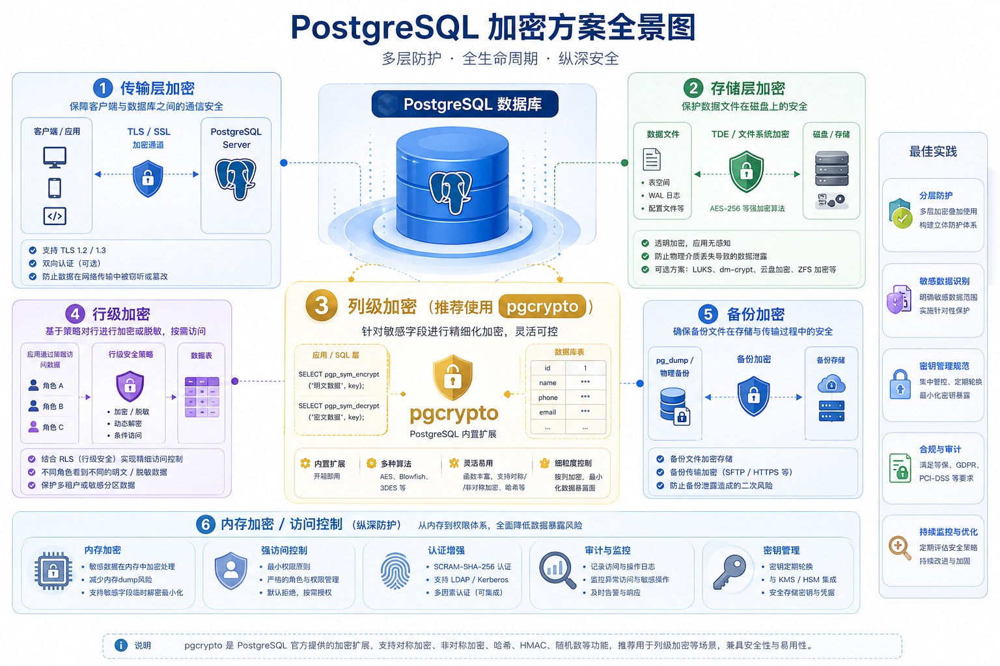
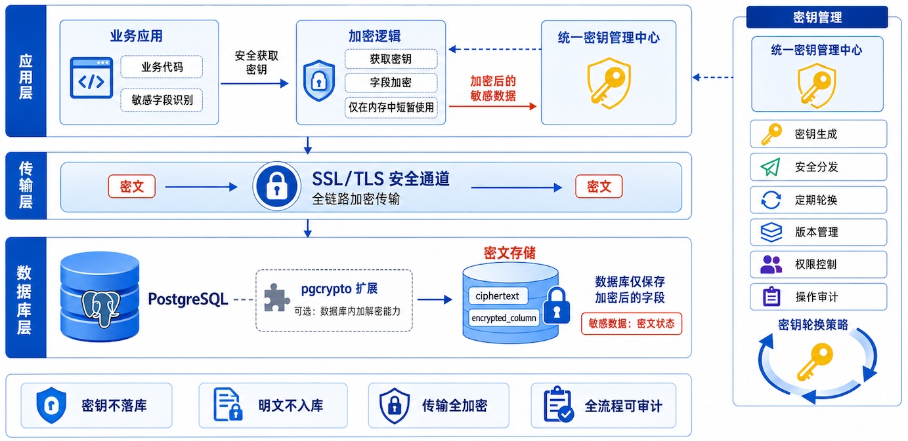
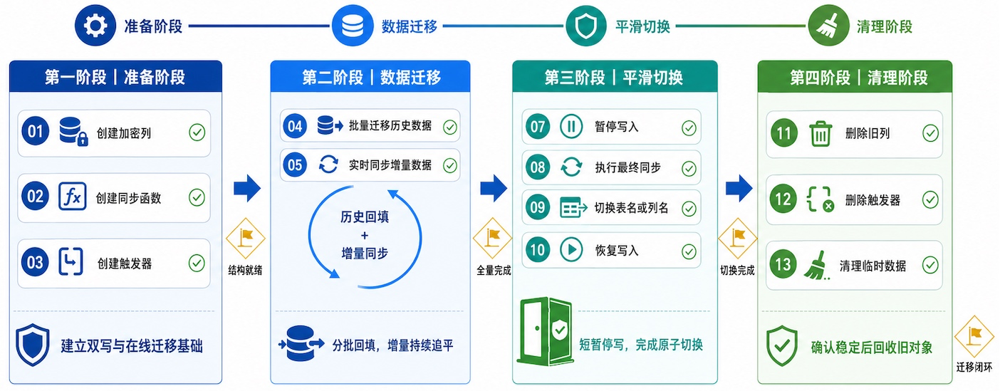

---

# PostgreSQL 列级加密实战：pgcrypto 从入门到在线迁移

> **作者**：360智汇云（zyun360）
> **发布日期**：2026-07-29
> **原文链接**：https://blog.csdn.net/zyun360/article/details/163310155
> **版权声明**：本文为博主原创文章，遵循 CC 4.0 BY-SA 版权协议

---

## 一、PostgreSQL 加密方案全景图

在数据安全日益重要的今天，数据库加密已经不是"要不要做"的问题，而是"怎么做更合适"的问题。PostgreSQL 提供了多层次的加密方案：

<!-- 此处原图：PostgreSQL 加密方案全景图（传输层加密、存储层加密、列级加密、行级加密、备份加密、内存加密/访问控制） -->



### 各层加密方案对比

| 加密层 | 保护对象 | 透明度 | 实现复杂度 | 推荐场景 |
|---|---|---|---|---|
| SSL/TLS 传输加密 | 网络传输数据 | 完全透明 | 低 | 所有生产环境 |
| TDE 存储加密 | 磁盘数据文件 | 完全透明 | 中 | 全盘敏感数据 |
| 备份加密 | 备份文件 | 完全透明 | 低 | 所有生产环境 |
| **列级加密** | **特定敏感字段** | 部分透明 | **高** | **本文重点** |
| 行级加密 | 单行数据 | 不透明 | 极高 | 极高安全要求 |
| 内存加密 | 内存数据 | 部分透明 | 中 | 商业/特殊场景 |

### 为什么需要 pgcrypto？

TDE 和文件系统加密保护的是"静态数据"，一旦数据被读取到内存，加密就解除了。而 **pgcrypto 提供的列级加密**，可以确保敏感字段在整个生命周期中都处于密文状态——从应用写入、数据库存储、到备份文件，全程加密。

> 💡 **pgcrypto 不是银弹**：它适用于需要对特定字段加密的场景。

---

## 二、pgcrypto 详解

### 2.1 优缺点分析

**✅ 优点**

| 优点 | 说明 |
|---|---|
| 列级加密粒度 | 可以只加密敏感字段（如手机号、身份证、密码），不影响其他字段的查询性能 |
| 端到端安全 | 数据在应用层加密后传输，即使数据库管理员直接查表也看不到明文（数据库侧仅存密文，密钥需在应用层或安全会话中管理） |
| 备份安全 | 物理备份、逻辑备份中数据已加密，防止备份泄露 |
| 开源免费 | PostgreSQL 内置扩展，无需额外付费 |

**❌ 缺点**

| 缺点 | 说明 |
|---|---|
| 索引限制 | 加密后的数据无法建立有效索引（密文无序），范围查询困难 |
| 查询性能下降 | 每次查询都需要加解密，CPU 开销明显 |
| 密钥管理复杂 | 密钥需要单独管理，泄露风险高 |
| 无法使用表达式索引 | 如 `WHERE phone LIKE '138%'` 这类前缀查询无法实现 |
| 不支持密文排序 | `ORDER BY encrypted_field` 没有意义 |

### 2.2 支持的加密方案

pgcrypto 扩展提供了多种加密函数，按用途可分为以下几类：

#### 2.2.1 哈希函数（不可逆）

```sql
-- MD5 (不安全，仅用于兼容性)
SELECT md5('password');
-- 输出: 5f4dcc3b5aa765d61d8327deb882cf99

-- SHA 系列 (适合摘要校验、完整性验证，不建议直接用于密码存储)
SELECT encode(digest('password', 'sha256'), 'hex');
-- 输出: 十六进制字符串

SELECT encode(digest('password', 'sha512'), 'hex');
-- 输出: 更长的十六进制字符串
```

> ⚠️ **安全警告**：MD5 和 SHA-1 已被破解，不应再用于密码存储。对于密码，推荐使用下面介绍的 `pgcrypto` 的 `crypt()` 系列函数，它们内置了盐值和迭代次数。

#### 2.2.2 对称加密（可逆）

```sql
-- 需要先启用 pgcrypto
CREATE EXTENSION IF NOT EXISTS pgcrypto;

-- AES 加密 (推荐, 256位)
-- encrypt_iv(data, key, algo, iv/null)
SELECT pgp_sym_encrypt('Sensitive Data', 'my_secret_key_256bit!!', 'cipher-algo=aes256');
-- 存储 BYTEA 类型

-- 解密
SELECT pgp_sym_decrypt(
    pgp_sym_encrypt('Sensitive Data', 'my_secret_key_256bit!!', 'cipher-algo=aes256'),
    'my_secret_key_256bit!!'
);
-- 输出: Sensitive Data
```

#### 2.2.3 加密算法对照表

| 算法 | 类型 | 密钥长度 | 安全性 | 推荐场景 |
|---|---|---|---|---|
| **BF** (Blowfish) | 对称加密 | 128-bit | ✅ 中等 | 仅用于兼容旧系统 |
| **AES** | 对称加密 | 128/192/256-bit | ✅✅ 推荐 | 通用场景 |
| **AES256** | 对称加密 | 256-bit | ✅✅✅ 最推荐 | 高敏感数据 |
| **MD5** | 哈希 | 128-bit | ❌ 不安全 | 仅兼容性 |
| **SHA1** | 哈希 | 160-bit | ⚠️ 弱 | 仅兼容性 |
| **SHA256** | 哈希 | 256-bit | ✅ 安全 | 密码存储 |
| **SHA512** | 哈希 | 512-bit | ✅✅ 推荐 | 密码存储 |

#### 2.2.4 密码哈希专用函数

pgcrypto 提供了专门用于密码哈希的 `crypt()` 函数，使用内置盐值和迭代机制：

```sql
-- 创建密码哈希 (自动加盐)
SELECT crypt('user_password', gen_salt('bf'));
-- 输出: $2a$12$xxxxxx (bcrypt 格式)

-- 验证密码
SELECT crypt('user_password', '$2a$12$xxxxxx') = '$2a$12$xxxxxx';
-- 输出: true

-- 常用算法: bf (blowfish), xdes, md5
SELECT gen_salt('bf');      -- 推荐，安全性最高
SELECT gen_salt('md5');     -- 仅兼容性
```

### 2.3 技术原理

pgcrypto 的核心原理可以分为以下几个层面：

#### 2.3.1 加密模型


#### 2.3.2 两种加密模式

pgcrypto 支持两种加密模式：

1. **PGP 模式**（推荐）：使用 OpenPGP 标准，对称加密内置盐值和会话密钥，安全性高；公钥加密支持密钥 ID 管理。
2. **低级加密函数**：需要手动管理 IV 和密钥，灵活性高但易出错。

#### 2.3.3 密钥派生函数 (KDF)

为了防止暴力破解，pgcrypto 在内部使用了多种密钥派生机制，S2K 会自动加入随机盐值，并通过多次哈希迭代增强抗破解能力：

```
Key = S2K(password, salt, iterations, hash_algorithm)
```

### 2.4 简单使用示例

#### 2.4.1 安装与基础配置

```sql
-- 1. 创建 pgcrypto 扩展
CREATE EXTENSION IF NOT EXISTS pgcrypto;

-- 2. 验证安装
SELECT extname, extversion FROM pg_extension WHERE extname = 'pgcrypto';
-- 输出: pgcrypto | 1.3
```

#### 2.4.2 用户密码安全存储

```sql
-- 创建用户表 (密码使用 bcrypt 加密)
CREATE TABLE users (
    id SERIAL PRIMARY KEY,
    username VARCHAR(50) UNIQUE NOT NULL,
    password_hash VARCHAR(255) NOT NULL,  -- 存储加密后的哈希
    created_at TIMESTAMP DEFAULT NOW()
);

-- 注册用户 (密码加密存储)
INSERT INTO users (username, password_hash)
VALUES ('john_doe', crypt('SecureP@ssw0rd!', gen_salt('bf')));

-- 登录验证
CREATE OR REPLACE FUNCTION check_user_password(
    p_username VARCHAR,
    p_password VARCHAR
) RETURNS BOOLEAN AS $$
DECLARE
    v_hash VARCHAR;
BEGIN
    SELECT password_hash INTO v_hash
    FROM users
    WHERE username = p_username;

    IF v_hash IS NULL THEN
        RETURN FALSE;
    END IF;

    RETURN crypt(p_password, v_hash) = v_hash;
END;
$$ LANGUAGE plpgsql;

-- 测试登录
SELECT check_user_password('john_doe', 'SecureP@ssw0rd!');  -- true
SELECT check_user_password('john_doe', 'WrongPassword');     -- false
```

#### 2.4.3 敏感字段加解密

```sql
-- 创建客户表 (加密手机号和身份证)
CREATE TABLE customers (
    id SERIAL PRIMARY KEY,
    name VARCHAR(100),
    phone_encrypted BYTEA,    -- 加密手机号
    id_card_encrypted BYTEA,  -- 加密身份证
    email_encrypted BYTEA     -- 加密邮箱
);

-- 加密和解密函数
CREATE OR REPLACE FUNCTION encrypt_field(
    data TEXT,
    secret_key TEXT
) RETURNS BYTEA AS $$
BEGIN
    RETURN pgp_sym_encrypt(data, secret_key, 'cipher-algo=aes256');
END;
$$ LANGUAGE plpgsql VOLATILE;

CREATE OR REPLACE FUNCTION decrypt_field(
    encrypted_data BYTEA,
    secret_key TEXT
) RETURNS TEXT AS $$
BEGIN
    RETURN pgp_sym_decrypt(encrypted_data, secret_key);
END;
$$ LANGUAGE plpgsql STABLE;

-- 插入加密数据
INSERT INTO customers (name, phone_encrypted, id_card_encrypted, email_encrypted)
VALUES (
    '张三',
    encrypt_field('13800138000', 'my-app-secret-key!!'),
    encrypt_field('110101199001011234', 'my-app-secret-key!!'),
    encrypt_field('zhangsan@example.com', 'my-app-secret-key!!')
);

-- 查询解密数据
SELECT
    name,
    decrypt_field(phone_encrypted, 'my-app-secret-key!!') AS phone,
    decrypt_field(id_card_encrypted, 'my-app-secret-key!!') AS id_card,
    decrypt_field(email_encrypted, 'my-app-secret-key!!') AS email
FROM customers
WHERE name = '张三';
```

---

## 三、应用场景示例

### 场景一：用户密码安全存储

这是 pgcrypto 最经典的使用场景。

```sql
-- 使用 bcrypt 加密用户密码 (最佳实践)
CREATE TABLE app_users (
    id SERIAL PRIMARY KEY,
    email VARCHAR(255) UNIQUE NOT NULL,
    password_hash VARCHAR(255) NOT NULL,
    last_login TIMESTAMP
);

-- 安全注册
CREATE OR REPLACE FUNCTION safe_register(
    p_email VARCHAR,
    p_password VARCHAR
) RETURNS INTEGER AS $$
DECLARE
    v_user_id INTEGER;
BEGIN
    -- 检查邮箱是否已注册
    IF EXISTS (SELECT 1 FROM app_users WHERE email = p_email) THEN
        RAISE EXCEPTION '邮箱已被注册';
    END IF;

    -- 插入用户 (密码使用 bcrypt 加密，cost factor 12)
    INSERT INTO app_users (email, password_hash)
    VALUES (
        p_email,
        crypt(p_password, gen_salt('bf', 12))
    )
    RETURNING id INTO v_user_id;

    RETURN v_user_id;
END;
$$ LANGUAGE plpgsql;

-- 安全登录
CREATE OR REPLACE FUNCTION safe_login(
    p_email VARCHAR,
    p_password VARCHAR
) RETURNS BOOLEAN AS $$
DECLARE
    v_stored_hash VARCHAR;
BEGIN
    SELECT password_hash INTO v_stored_hash
    FROM app_users
    WHERE email = p_email;

    IF v_stored_hash IS NULL THEN
        RETURN FALSE;  -- 用户不存在，不透露信息
    END IF;

    -- 验证密码
    RETURN crypt(p_password, v_stored_hash) = v_stored_hash;
END;
$$ LANGUAGE plpgsql;

-- 注册，返回用户 id（例如 1）
SELECT safe_register('zhangsan@example.com', 'MySecurePass123!');

-- 正确密码应返回 true
SELECT safe_login('zhangsan@example.com', 'MySecurePass123!');
```

### 场景二：金融数据加密

```sql
-- 金融交易表 (加密交易金额和账户信息)
CREATE TABLE financial_transactions (
    id BIGSERIAL PRIMARY KEY,
    account_number_encrypted BYTEA NOT NULL,
    transaction_type VARCHAR(20) NOT NULL,
    amount_encrypted BYTEA NOT NULL,  -- 金额也加密
    transaction_date TIMESTAMP DEFAULT NOW(),
    description TEXT
);

-- 加密插入
INSERT INTO financial_transactions
    (account_number_encrypted, transaction_type, amount_encrypted, description)
VALUES (
    encrypt_field('6222021234567890', 'finance-dept-key-2026!'),
    'TRANSFER',
    encrypt_field('50000.00', 'finance-dept-key-2026!'),
    '跨行转账'
);

-- 查询统计 (需要解密后处理)
SELECT
    decrypt_field(account_number_encrypted, 'finance-dept-key-2026!') AS account,
    transaction_type,
    decrypt_field(amount_encrypted, 'finance-dept-key-2026!') AS amount,
    transaction_date
FROM financial_transactions
WHERE transaction_date > NOW() - INTERVAL '30 days';
```

### 场景三：医疗健康数据加密

```sql
-- 医疗记录表 (加密诊断和处方)
CREATE TABLE medical_records (
    id SERIAL PRIMARY KEY,
    patient_id VARCHAR(50) NOT NULL,
    diagnosis_encrypted BYTEA,
    prescription_encrypted BYTEA,
    lab_results_encrypted BYTEA,
    record_date DATE DEFAULT CURRENT_DATE
);

-- 医生查看 (需要实现权限控制)
CREATE OR REPLACE FUNCTION get_patient_records(
    p_patient_id VARCHAR,
    p_doctor_id VARCHAR  -- 应通过应用层权限验证
) RETURNS TABLE (
    record_id INTEGER,
    diagnosis TEXT,
    prescription TEXT,
    lab_results TEXT
) AS $$
BEGIN
    RETURN QUERY
    SELECT
        mr.id,
        decrypt_field(mr.diagnosis_encrypted, 'test-key-2026'),
        decrypt_field(mr.prescription_encrypted, 'test-key-2026'),
        decrypt_field(mr.lab_results_encrypted, 'test-key-2026')
    FROM medical_records mr
    WHERE mr.patient_id = p_patient_id;
END;
$$ LANGUAGE plpgsql;

-- 录入数据
INSERT INTO medical_records (patient_id, diagnosis_encrypted)
VALUES
    ('P001', pgp_sym_encrypt('高血压', 'test-key-2026', 'cipher-algo=aes256')),
    ('P001', pgp_sym_encrypt('糖尿病', 'test-key-2026', 'cipher-algo=aes256')),
    ('P002', pgp_sym_encrypt('骨折', 'test-key-2026', 'cipher-algo=aes256'));

-- 解密查看
SELECT id, patient_id, pgp_sym_decrypt(diagnosis_encrypted, 'test-key-2026')::TEXT
FROM medical_records;
```

---


## 四、在线迁移：已有数据如何在线基本无损使用 pgcrypto


### 4.1 迁移策略概述


### 4.2 详细迁移步骤

#### 第一步：创建加密列和辅助字段

```sql
-- 假设原有表结构
CREATE TABLE customers_old (
    id SERIAL PRIMARY KEY,
    name VARCHAR(100),
    phone VARCHAR(20),      -- 要加密的字段
    id_card VARCHAR(18),    -- 要加密的字段
    email VARCHAR(100),
    updated_at TIMESTAMP DEFAULT NOW()
);

-- 插入测试数据（模拟已有记录）
INSERT INTO customers_old (name, phone, id_card, email, updated_at) VALUES
('张三', '13812345678', '11010119900307663X', 'zhangsan@example.com', NOW()),
('李四', '15987654321', '310101198512124567', 'lisi@example.com', NOW()),
('王五', '18612345678', '440301199912312345', 'wangwu@example.com', NOW()),
('赵六', '13511112222', '510105200105011234', 'zhaoliu@example.com', NOW()),
('孙七', '17733334444', '12010120200202222X', 'sunqi@example.com', NOW());

-- 1. 添加加密列 (保持原列不变)
ALTER TABLE customers_old
ADD COLUMN phone_encrypted BYTEA;

ALTER TABLE customers_old
ADD COLUMN id_card_encrypted BYTEA;

-- 2. 添加状态标记列 (用于追踪迁移进度)
ALTER TABLE customers_old
ADD COLUMN migration_status VARCHAR(20) DEFAULT 'pending';

-- 添加索引 (可选，用于迁移时的查询优化)
CREATE INDEX idx_migration_status ON customers_old(migration_status);
```

#### 第二步：创建触发器和实时同步机制

```sql
-- 创建加密函数
CREATE OR REPLACE FUNCTION encrypt_customer_field()
RETURNS TRIGGER AS $$
BEGIN
    -- 当原字段有值且加密列为空时，加密并写入
    IF NEW.phone IS NOT NULL AND NEW.phone_encrypted IS NULL THEN
        NEW.phone_encrypted := encrypt_field(NEW.phone, 'migration-secret-key');
        NEW.migration_status := 'synced';
    END IF;

    IF NEW.id_card IS NOT NULL AND NEW.id_card_encrypted IS NULL THEN
        NEW.id_card_encrypted := encrypt_field(NEW.id_card, 'migration-secret-key');
    END IF;

    RETURN NEW;
END;
$$ LANGUAGE plpgsql;

-- 创建触发器 (行级)
CREATE TRIGGER trg_encrypt_customer
BEFORE INSERT OR UPDATE ON customers_old
FOR EACH ROW
EXECUTE FUNCTION encrypt_customer_field();

-- 注意：UPDATE 触发器需要特殊处理，避免无限循环
CREATE OR REPLACE FUNCTION encrypt_customer_field_update()
RETURNS TRIGGER AS $$
BEGIN
    -- 仅在新数据且未加密时加密
    IF TG_OP = 'INSERT' THEN
        IF NEW.phone IS NOT NULL THEN
            NEW.phone_encrypted := encrypt_field(NEW.phone, 'migration-secret-key');
        END IF;
        IF NEW.id_card IS NOT NULL THEN
            NEW.id_card_encrypted := encrypt_field(NEW.id_card, 'migration-secret-key');
        END IF;
        NEW.migration_status := 'synced';
        RETURN NEW;
    END IF;

    -- UPDATE: 只处理从未加密过的记录
    IF TG_OP = 'UPDATE' THEN
        IF OLD.phone_encrypted IS NULL AND NEW.phone IS NOT NULL THEN
            NEW.phone_encrypted := encrypt_field(NEW.phone, 'migration-secret-key');
        END IF;
        IF OLD.id_card_encrypted IS NULL AND NEW.id_card IS NOT NULL THEN
            NEW.id_card_encrypted := encrypt_field(NEW.id_card, 'migration-secret-key');
        END IF;

        -- 如果本次更新包含了加密操作，更新状态
        IF OLD.phone_encrypted IS NULL AND NEW.phone_encrypted IS NOT NULL THEN
            NEW.migration_status := 'synced';
        END IF;

        RETURN NEW;
    END IF;

    RETURN NEW;
END;
$$ LANGUAGE plpgsql;

-- 删除旧触发器并创建新的
DROP TRIGGER IF EXISTS trg_encrypt_customer ON customers_old;
CREATE TRIGGER trg_encrypt_customer
BEFORE INSERT OR UPDATE ON customers_old
FOR EACH ROW
EXECUTE FUNCTION encrypt_customer_field_update();
```

#### 第三步：批量迁移历史数据

```sql
-- 创建批量迁移函数
CREATE OR REPLACE FUNCTION migrate_customer_batch(
    p_batch_size INTEGER DEFAULT 1000
) RETURNS INTEGER AS $$
DECLARE
    v_updated INTEGER;
BEGIN
    -- 批量加密未迁移的数据
    UPDATE customers_old
    SET
        phone_encrypted = encrypt_field(phone, 'migration-secret-key'),
        id_card_encrypted = encrypt_field(id_card, 'migration-secret-key'),
        migration_status = 'synced'
    WHERE migration_status = 'pending'
    AND id IN (
        SELECT id FROM customers_old
        WHERE migration_status = 'pending'
        LIMIT p_batch_size
    );

    GET DIAGNOSTICS v_updated = ROW_COUNT;
    RETURN v_updated;
END;
$$ LANGUAGE plpgsql;

-- 执行批量迁移 (循环直到全部完成)
DO $$
DECLARE
    v_remaining INTEGER;
    v_batch INTEGER;
BEGIN
    -- 统计待迁移数据
    SELECT COUNT(*) INTO v_remaining
    FROM customers_old
    WHERE migration_status = 'pending';

    RAISE NOTICE '待迁移数据: % 条', v_remaining;

    -- 循环迁移，每批1000条
    WHILE v_remaining > 0 LOOP
        SELECT migrate_customer_batch(1000) INTO v_batch;
        v_remaining := v_remaining - v_batch;
        RAISE NOTICE '剩余: % 条', v_remaining;

        -- 每批之间休息100ms，避免CPU过载
        PERFORM pg_sleep(0.1);
    END LOOP;

    RAISE NOTICE '迁移完成!';
END;
$$;
```

#### 第四步：验证数据一致性

```sql
-- 验证函数
CREATE OR REPLACE FUNCTION verify_migration()
RETURNS TABLE(status text, count BIGINT) AS $$
BEGIN
    RETURN QUERY
    SELECT
        CASE
            WHEN migration_status = 'synced' AND phone_encrypted IS NOT NULL AND id_card_encrypted IS NOT NULL
            THEN '加密成功'
            WHEN migration_status = 'synced' AND (phone_encrypted IS NULL OR id_card_encrypted IS NULL)
            THEN '状态异常-未加密'
            WHEN migration_status = 'pending'
            THEN '未迁移'
            ELSE '其他'
        END AS status,
        COUNT(*) AS count
    FROM customers_old
    GROUP BY 1;
END;
$$ LANGUAGE plpgsql;

-- 执行验证
SELECT * FROM verify_migration();

-- 抽样解密验证
SELECT
    id,
    phone,
    decrypt_field(phone_encrypted, 'migration-secret-key') AS phone_decrypted,
    CASE WHEN phone = decrypt_field(phone_encrypted, 'migration-secret-key')
         THEN '匹配' ELSE '不匹配' END AS verify
FROM customers_old
WHERE migration_status = 'synced'
LIMIT 10;
```

#### 第五步：平滑切换（双写阶段）

```sql
-- 创建新表结构 (生产使用)
CREATE TABLE customers_new (
    id SERIAL PRIMARY KEY,
    name VARCHAR(100),
    phone_encrypted BYTEA NOT NULL,
    id_card_encrypted BYTEA NOT NULL,
    email VARCHAR(100),
    created_at TIMESTAMP DEFAULT NOW(),
    migrated_at TIMESTAMP DEFAULT NOW()
);

-- 从旧表迁移数据到新表
INSERT INTO customers_new (id, name, phone_encrypted, id_card_encrypted, email, created_at)
SELECT
    id,
    name,
    phone_encrypted,
    id_card_encrypted,
    email,
    updated_at
FROM customers_old
WHERE migration_status = 'synced';

-- 验证记录数一致性
SELECT
    (SELECT COUNT(*) FROM customers_old WHERE migration_status = 'synced') AS old_count,
    (SELECT COUNT(*) FROM customers_new) AS new_count,
    (SELECT COUNT(*) FROM customers_old WHERE migration_status = 'pending') AS pending_count;
```

#### 第六步：表重命名切换（原子操作，不宕机）

```sql
-- 原子切换 (在业务低峰期执行，通常只需要秒级锁)
BEGIN;

-- 1. 重命名旧表
ALTER TABLE customers_old RENAME TO customers_backup;

-- 2. 重命名新表
ALTER TABLE customers_new RENAME TO customers_old;

-- 3. 重建索引
CREATE INDEX IF NOT EXISTS idx_customer_phone ON customers_old USING BTREE(phone_encrypted);
CREATE INDEX IF NOT EXISTS idx_customer_idcard ON customers_old USING BTREE(id_card_encrypted);

COMMIT;

-- 更新应用层的加解密密钥配置
-- 在应用配置中将 'migration-secret-key' 切换为正式的生产密钥
```

#### 第七步：清理旧数据

```sql
-- 确认业务正常运行后，删除备份表和临时数据
-- ⚠️ 此步骤不可逆，请确保已验证数据完整性
DROP TABLE IF EXISTS customers_backup;

-- 删除临时函数
DROP FUNCTION IF EXISTS encrypt_customer_field_update();
DROP FUNCTION IF EXISTS migrate_customer_batch(INTEGER);
DROP FUNCTION IF EXISTS verify_migration();
DROP FUNCTION IF EXISTS encrypt_field(TEXT, TEXT);
DROP FUNCTION IF EXISTS decrypt_field(BYTEA, TEXT);
```

> ⚠️ **注意**：上面在线迁移只是针对小数据量的模拟案例，如果涉及线上数据转换务必进行充分测试验证。

---

## 五、 检索加密字段

有些情况，可能会对加密字段进行检索， 比如手机号。

思路， 对手机号进行不可逆hash 存储。然后创建索引。在检索的时候对手机号进行同样的hash后进行等值检索。

|            | 裸 SHA-256 | HMAC      |
| ---------- | --------- | --------- |
| 无密钥        | ✅         | 需要密钥      |
| 防彩虹表       | 预计算表有效    | 预计算完全无效   |
| 暴力枚举所有号码   | 可行        | 没有密钥无法开始算 |
| 泄露数据库但密钥安全 | 号码可被还原    | 号码安全      |


select encode(hmac('13800001234', '你的密钥', 'sha256'),'hex');

## 六、总结

加密是安全的第一道防线，但不是唯一防线。做好权限控制、网络隔离、入侵检测等多层防护，才能构建完整的数据安全体系。

目前智汇云 PostgreSQL 产品已支持 pgcrypto 扩展，欢迎大家使用。

